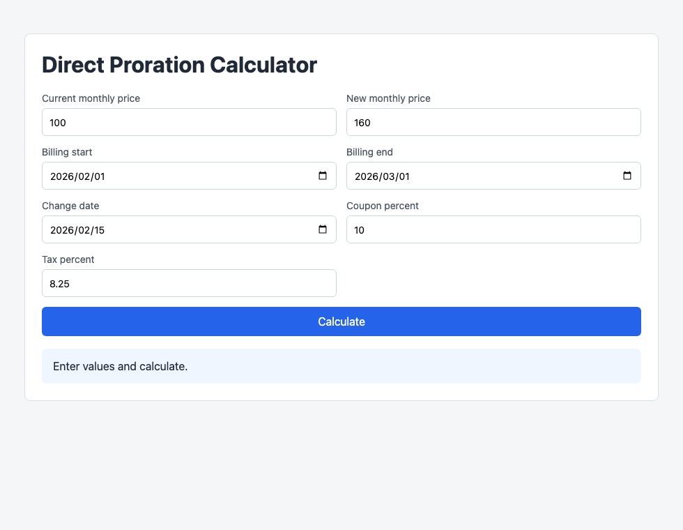
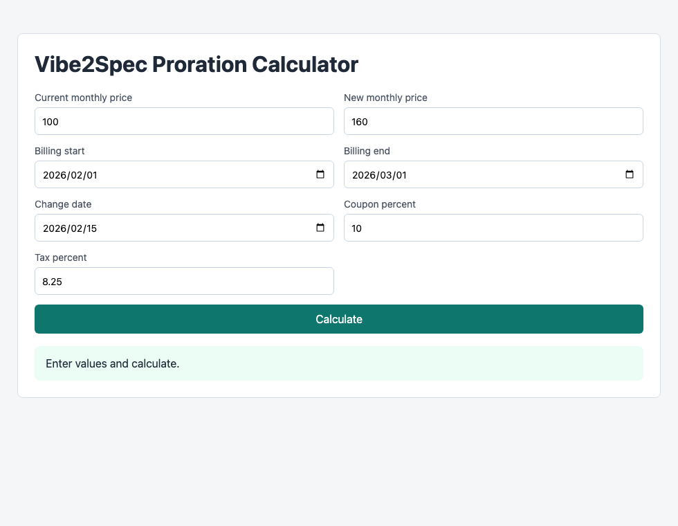

# Proration Calculator: Direct Baseline vs Vibe2Spec

Date: 2026-06-05

## Why This Task

The earlier Todo deadline task was too small: Direct and Vibe2Spec both passed the same functional probe. This experiment uses a harder static Web task where missing requirements commonly cause real calculation errors:

> Build a subscription upgrade/downgrade proration calculator.

The task includes edge cases that are easy to miss without a Spec:

- Actual billing-period day count instead of fixed 30-day months.
- Leap-year February.
- Coupon before tax.
- Tax on net prorated delta.
- Final-only rounding to cents.
- Negative downgrade result as refund.
- Invalid date range rejection.

## Compared Artifacts

| Workflow | Implementation | Planning artifacts |
| --- | --- | --- |
| Direct baseline | `direct-baseline/index.html` | short README only |
| Vibe2Spec | `vibe2spec/index.html` | proposal, design, tasks, prompt, verification |

## Render Evidence

Both implementations render under the same Chrome headless command shape and viewport `980x760`.

| Direct baseline | Vibe2Spec |
| --- | --- |
|  |  |

Both pages load and show the required form fields and result area. UI rendering alone does not reveal the calculation bug.

## Functional Probe

Command:

```bash
python3 experiments/proration-vibe2spec-vs-direct-20260605/probe_proration.py <target-index.html>
```

Result files:

- `direct-probe-result.json`
- `vibe2spec-probe-result.json`

Summary:

| Workflow | Probe Result |
| --- | ---: |
| Direct baseline | 2 / 6 |
| Vibe2Spec | 6 / 6 |

## Detailed Results

| Check | Direct baseline | Vibe2Spec |
| --- | --- | --- |
| exposes `calculateProration` | Pass | Pass |
| does not use fixed 30-day billing period | Fail | Pass |
| February 2026 coupon + tax | Fail: `27.28`, uses 30 days | Pass: `29.23`, 28 period days |
| Leap-year February | Fail: `30.00`, uses 30 days | Pass: `31.03`, 29 period days |
| Downgrade refund | Fail: `-32.00`, uses 30 days | Pass: `-30.97`, 31 period days |
| Invalid end before start | Pass | Pass |

## What The Spec Changed

The Direct baseline implemented the visible request and produced a usable calculator, but made a common simplification:

```text
periodDays = 30
```

That looks reasonable for a brief prompt, but it breaks real billing cases.

The Vibe2Spec version made the hidden billing assumptions explicit before implementation:

- EARS requirement: use actual day difference between billing start and billing end.
- ADR: parse date-only values using UTC arithmetic.
- Acceptance fixture: February 2026 is 28 days.
- Acceptance fixture: February 2024 is 29 days.
- Acceptance fixture: downgrade can be negative and is a refund.

Because those rules were present in the Spec, the implementation had concrete numbers to satisfy instead of an informal “按天计费” interpretation.

## Artifact Validation

Command:

```bash
PYTHONPATH=src python3 -m codex_harness.cli validate-artifacts -C experiments/proration-vibe2spec-vs-direct-20260605/vibe2spec
```

Result:

```text
Artifact validation passed for: .../experiments/proration-vibe2spec-vs-direct-20260605/vibe2spec
```

The Direct baseline intentionally has no Spec artifact chain, so artifact validation is not applicable there.

## Fair Conclusion

This harder task does show the advantage of Spec-first development:

- Direct baseline renders and appears usable, but fails 3 billing fixtures because it assumes 30-day months.
- Vibe2Spec passes all fixtures because the Spec encoded exact edge cases before implementation.

The advantage is not “more documents”. The advantage is that ambiguous business rules become executable acceptance fixtures before code is written.

## Limitations

- The Direct baseline is a direct-style implementation artifact in this repository, not a recorded fresh stochastic Codex sample.
- Browser click automation was not available in this environment, so the probe is deterministic source/logic detection plus Chrome render screenshots.
- A stronger study would run multiple fresh direct samples and multiple Vibe2Spec samples, then compare average missing requirements and rework rounds.
