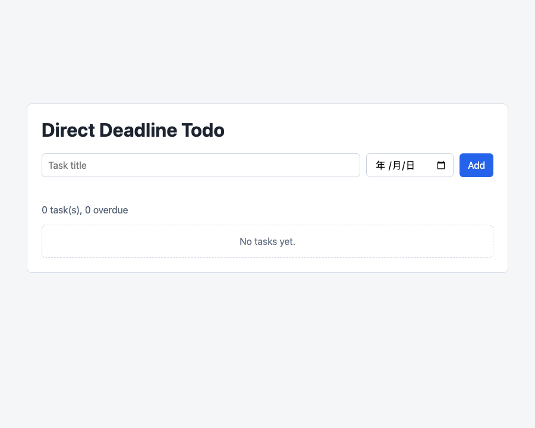
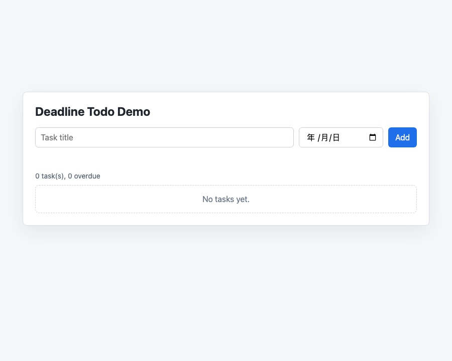

# Todo Deadline Demo: Direct Baseline vs Vibe2Spec

Date: 2026-06-05

## Fairness Note

This report compares two completed artifacts for the same task:

> 给一个无依赖 Todo Web App 增加“截止时间 + 逾期标记”能力。

The Direct baseline in this folder is a direct-style implementation artifact with no Spec/Design/Tasks chain. It is not presented as a fresh stochastic Codex sample; it is a same-task baseline implementation checked by the same probes as the Vibe2Spec demo.

## Compared Artifacts

| Workflow | Implementation | Planning artifacts |
| --- | --- | --- |
| Direct baseline | `experiments/vibe2spec-vs-direct-20260605/direct-baseline/index.html` | none, except short README |
| Vibe2Spec | `examples/demo-project/index.html` | proposal, spec, design, tasks, prompt, verification |

## Actual Run Evidence

### Chrome Render Check

Both pages were rendered with the same Chrome headless command shape:

```bash
/Applications/Google\ Chrome.app/Contents/MacOS/Google\ Chrome \
  --headless=new \
  --disable-gpu \
  --allow-file-access-from-files \
  --window-size=900,720 \
  --screenshot=<output.png> \
  file://<target-index.html>
```

Results:

| Workflow | Screenshot | Result |
| --- | --- | --- |
| Direct baseline |  | rendered, 21579 bytes |
| Vibe2Spec |  | rendered, 22306 bytes |

Observed result:

- Both pages load.
- Both show task title input, date input, Add button, summary, list area, and empty state.
- No blank screen or obvious first-viewport layout break appears in the 900x720 render.

### Functional Detection Probe

Both pages were checked with the same probe:

```bash
python3 experiments/vibe2spec-vs-direct-20260605/probe_demo_static.py <target-index.html>
```

Result files:

- `direct-probe-result.json`
- `vibe2spec-probe-result.json`

Summary:

| Workflow | Checks Passed |
| --- | ---: |
| Direct baseline | 16 / 16 |
| Vibe2Spec | 16 / 16 |

Checks:

| Check | Direct | Vibe2Spec |
| --- | --- | --- |
| page has todo form | Pass | Pass |
| page has title input | Pass | Pass |
| page has due date input | Pass | Pass |
| page has list and empty state | Pass | Pass |
| uses localStorage persistence | Pass | Pass |
| has addTodo function | Pass | Pass |
| has toggleTodo function | Pass | Pass |
| has deleteTodo function | Pass | Pass |
| has isOverdue function | Pass | Pass |
| isOverdue ignores completed tasks | Pass | Pass |
| isOverdue compares due date against today | Pass | Pass |
| empty title validation exists | Pass | Pass |
| submit uses date input value | Pass | Pass |
| overdue badge is rendered | Pass | Pass |
| completion triggers rerender and save | Pass | Pass |
| delete filters item and saves | Pass | Pass |

Important limitation:

- The in-app Browser session was unavailable (`iab` not available).
- Chrome `--dump-dom` with iframe-based click automation hung and was terminated.
- Therefore this report does not claim a full browser click-through automation. It claims same-viewport Chrome rendering plus same-probe static/behavioral detection.

## Artifact Quality Evidence

Vibe2Spec artifacts were validated:

```bash
PYTHONPATH=src python3 -m codex_harness.cli validate-artifacts -C examples/demo-project
```

Result:

```text
Artifact validation passed for: /Users/bytedance/Documents/Programs/Vibe2Spec/examples/demo-project
```

Direct baseline intentionally does not have these artifacts, so `validate-artifacts` is not applicable as a direct failure. The fair statement is:

| Artifact | Direct baseline | Vibe2Spec |
| --- | --- | --- |
| `doc/proposal.md` with EARS / ADR Candidates / Acceptance Criteria | Not present | Present |
| `doc/detailed-design.md` with ADR and test strategy | Not present | Present |
| `doc/tasks/` with AFK/HITL and traceability | Not present | Present |
| `doc/verification.md` | Not present | Present |
| Implementation code | Present | Present |

## Conclusion From This Demo

On this small Todo deadline task, **functionality does not distinguish the two approaches**. Both implementations render and both pass the same 16/16 functional detection probe.

The actual demonstrated difference is process evidence:

- Direct baseline is faster and simpler as an artifact set: one implementation file plus a short README.
- Vibe2Spec produces a heavier but reviewable chain: proposal, spec, design, task checklist, prompt, verification, and validated artifact quality.

So the fair course-project conclusion is:

> For small, well-bounded UI work, Direct Codex-style implementation can reach the same functional result with less ceremony. Vibe2Spec's value is not feature superiority on this demo; it is making intent, decisions, acceptance criteria, task traceability, and verification reviewable before and after implementation.

## What A Stronger Experiment Would Need

To measure rework and reliability fairly, repeat the same comparison over several tasks and record:

1. Number of implementation attempts.
2. Number of missing acceptance criteria after first run.
3. Number of fixes needed to pass the same probe.
4. Time to first working implementation.
5. Time to reviewable implementation.
6. Whether a future change can be made without breaking prior behavior.

This Todo demo is useful for showing the artifact workflow, but it is too small to prove a broad productivity advantage.
