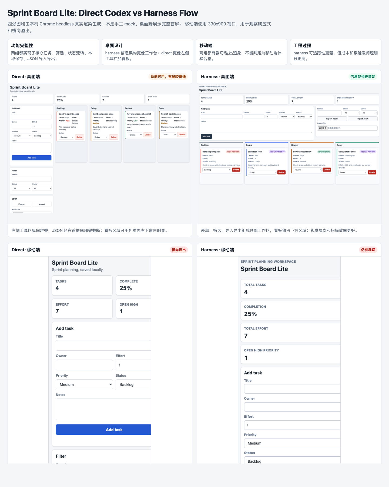
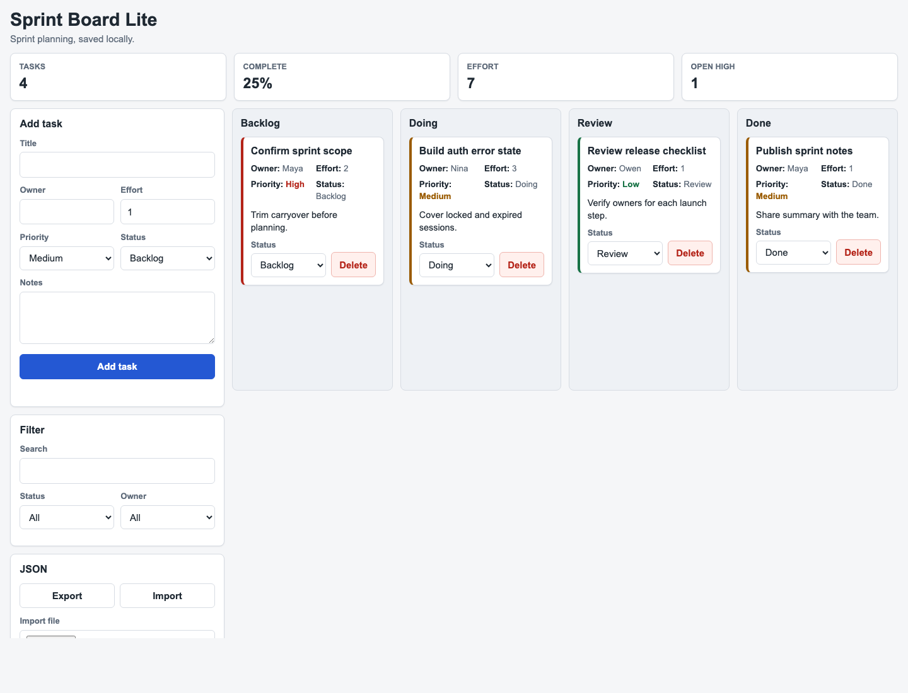
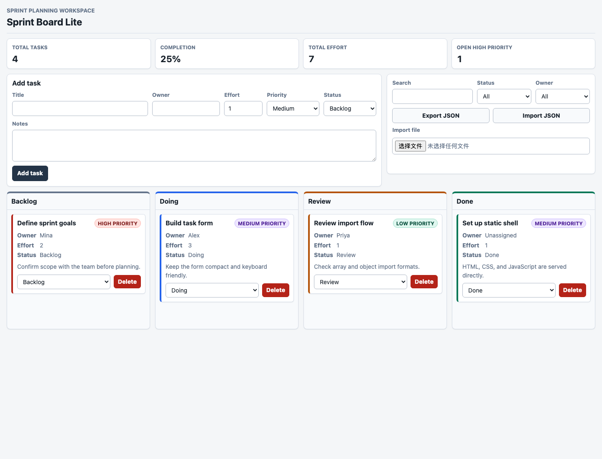
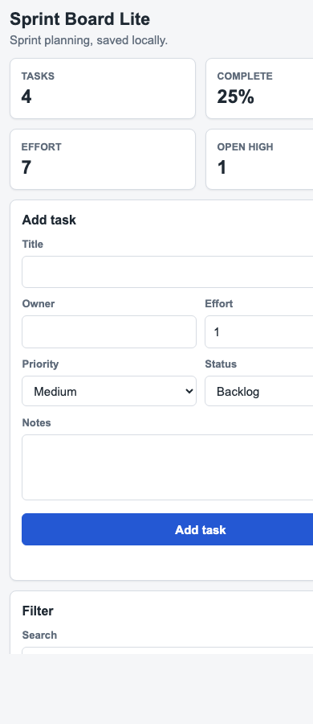
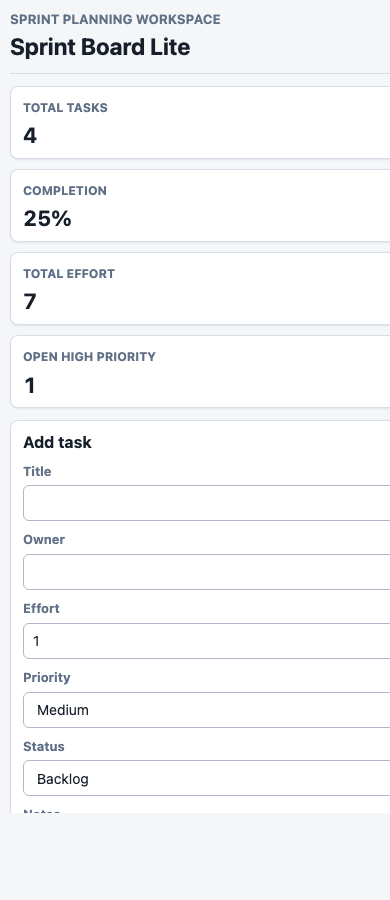

# Web 端开发对比实验报告：Direct Codex vs Harness Flow

## 实验设置

- 任务：实现一个无依赖静态 Web 应用 `Sprint Board Lite`，包含任务新增、四列看板、状态流转、筛选、KPI、本地持久化和 JSON 导入导出。
- Direct 组：把同一需求直接交给 Codex 一次生成。
- Harness 组：先用 harness 生成需求、设计、任务和最终实现 prompt，再用该 prompt 触发 Codex 实现，并允许多 agent 调度。
- 截图：由本机 Chrome headless 真实渲染生成，桌面视口 `1440x1100`，移动视口 `390x900`。

## 真实截图

总览图：

| Direct 桌面端 | Harness 桌面端 |
|---|---|
|  |  |

| Direct 移动端 | Harness 移动端 |
|---|---|
|  |  |

对比总览页：[comparison.html](comparison.html)。该页面把四张真实截图并排并加了短评。

## 实现效果对比

| 维度 | Direct Codex | Harness Flow |
|---|---|---|
| 功能完整性 | 核心功能完整：新增、状态流转、删除、筛选、KPI、localStorage、JSON 导入导出均存在。契约测试 6/6 通过。 | 核心功能同样完整。契约测试 6/6 通过，并额外补了 focused 测试、Node-backed 逻辑断言和内存 DOM smoke。 |
| 桌面端设计 | 左侧表单/筛选/JSON 纵向堆叠，右侧看板可用，但首屏 JSON 区被截断，右下留白明显。 | 更像工作台：表单横向铺开，筛选和导入导出在右侧工具区，看板独占下方区域，信息架构和扫描效率更好。 |
| 移动端设计 | 390px 视口下 KPI 仍是两列，右侧被裁切，表单也偏宽。移动端不合格。 | KPI 变成单列，层次更清楚，但表单控件仍有右侧裁切迹象。移动端仍不合格。 |
| 验证质量 | 只保留原契约测试，验证覆盖较薄。 | 验证记录更完整：任务 checklist、验证文档、focused tests、替代 smoke 和阻塞记录都落盘。 |
| 可追踪性 | 产物直接，缺少需求/设计/任务链路。 | 从 `proposal -> detailed-design -> tasks -> prompt -> implementation` 全链路可追溯。 |
| 交付成本 | 一次 Codex 运行，速度快，过程干扰少。 | 多阶段、多次恢复、最终实现运行时间长；需要人工监督 false positive 和环境问题。 |

结论：这次不是“harness 产物功能明显碾压 direct”。两边功能都完成了。harness 的优势主要体现在桌面端信息架构、过程可追踪性、验证记录和多 agent 分工痕迹；direct 的优势是简单、快、成本低。移动端是共同短板。

## 验证结果

- Direct：`python3 -m unittest discover -s tests` 通过，6 tests OK。
- Harness：`python3 -m unittest discover -s tests` 通过，6 tests OK。
- Harness 额外验证：
  - `python3 -m py_compile tests/test_app_logic.py tests/test_static_contract.py` 通过。
  - focused pytest-style 测试函数通过 Python 标准库直接调用。
  - Node-backed 逻辑断言通过。
  - 内存 DOM smoke 通过，覆盖新增、空标题、状态移动、删除、搜索/筛选、empty state、导出、数组导入、对象导入、非法导入不覆盖、刷新恢复。

环境限制：

- `uv`、`pytest`、`mypy`、`ruff` 在实验环境不可用，不能形成这些命令的真实通过结果。
- in-app Browser 不可用；最终改用本机 Chrome headless 生成真实截图。
- 本地端口绑定在默认沙箱被拒绝，截图使用 `file://` 加 `--allow-file-access-from-files` 完成。

## 过程问题记录

- harness 阶段多次误判 `HARNESS_NEEDS_USER_INPUT`，包括 prompt 文本或普通总结中出现标记/相似语义时触发，导致需要人工 `NEXT_PHASE`。
- harness 的实现 prompt 对一个无依赖静态应用过度要求 `uv/pytest/mypy/ruff`，与实验环境不匹配。
- 多 agent 调度首次 spawn 失败：full-history fork 时不应显式传 `agent_type/model/reasoning_effort`。
- 多 agent 并发写作中，`src/styles.css` 曾短暂消失或处于中间态，后续被 worker 恢复。这说明并发写文件需要更强的写域隔离或合并协议。
- 内存 DOM smoke 首次失败来自测试 harness 自身选择器过宽，不是产品逻辑错误；修正后通过。
- Chrome headless 能生成截图，但当前环境下写出文件后偶发不自动退出，需要按日志 PID 清理临时进程。

## 定量对比

- Direct 代码规模：`index.html` 144 行，`src/styles.css` 441 行，`src/app.js` 553 行，`README.md` 28 行。
- Harness 代码与文档规模：`index.html` 154 行，`src/styles.css` 552 行，`src/app.js` 590 行，`tests/test_app_logic.py` 242 行，`pyproject.toml` 29 行，`doc/proposal.md` 199 行，`doc/detailed-design.md` 402 行，`doc/prompt.md` 211 行。
- Harness 任务文档：12 个模块 checklist 全部回写完成，`doc/tasks/progress.md` 与 `doc/tasks/verification.md` 记录实现和验证状态。

## 建议

1. 先修 harness 的误触发检测，只对 agent 最终显式输出的结构化 `HARNESS_NEEDS_USER_INPUT` 生效，不扫描 prompt 原文和普通日志。
2. 调整实现 prompt：按项目类型生成验证要求。静态无依赖 Web app 不应强制 `uv/pytest/mypy/ruff`。
3. 给多 agent 写文件加 ownership 检查：每个 worker 明确写域，主 agent 合并前检查文件是否短暂缺失或被覆盖。
4. 后续对比任务要加入统一截图基线：同一数据、同一视口、同一交互路径，并把移动端纳入硬性验收。
5. 结论上，当前 harness 更适合“需要可追踪规划和复杂协作”的任务；对小型静态应用，direct 的性价比更高。
